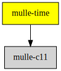

# 🕕 mulle-time

#### Simple time types with arithmetic on timespec and timeval

Defines `timespec_add`, `timespec_sub` and `timespec_compare` and their
timeval counterparts. `struct timespec` is more desirable, where available,
for improved precision in its representation.

This library defines `mulle_timeinterval_t` which will be used as 
`NSTimeInterval` in mulle-objc.

On Linux this library implicitly defines `_GNU_SOURCE` to get the 
`CLOCK_REALTIME` and `CLOCK_MONOTONIC` constants.

This library also defines these types based on `mulle_timeinterval_t`.

`mulle_calendartime_t` is to be used for keeping calendar related timestamps.
`mulle_absolutetime_t` is to be used for animation timestamps
`mulle_relativetime_t` is to be used for keeping delays and other relative quantities

These added types are mostly there to make code more readable, so that you
immediately know if a `mulle_timeinterval_t` contains, say a delay of 0.1s
or the date of "now + 0.1s".

Caution: do not mix `mulle_calendartime_t` and `mulle_calendartime_t`


Datatype                           | Description
-----------------------------------|---------------------------
`mulle_timeinterval_t`             | absolute or relative time stored as a `double`
`mulle_absolutetime_t`             | a timestamp 
`struct mulle_absolutetimerange`   | an absolute time range
`mulle_calendartime_t`             | a date value like today
`struct mulle_calendartimerange`   | an absolute date range, like today until tomorrow
`mulle_relativetime_t`             | a quantity of time like 10s
`struct mulle_relativetimerange`   | a time range of relative times, like delay, duration


### You are here




## Add

Use [mulle-sde](//github.com/mulle-sde) to add mulle-time to your project:

``` sh
mulle-sde dependency add --c --github mulle-core mulle-time
```

## Install

### mulle-sde

Use [mulle-sde](//github.com/mulle-sde) to build and install mulle-time
and all its dependencies:

``` sh
mulle-sde install --prefix /usr/local \
   https://github.com/mulle-core/mulle-time/archive/latest.tar.gz
```

### Manual Installation


Install into `/usr/local`:

``` sh
cmake -B build \
      -DCMAKE_INSTALL_PREFIX=/usr/local \
      -DCMAKE_PREFIX_PATH=/usr/local \
      -DCMAKE_BUILD_TYPE=Release &&
cmake --build build --config Release &&
cmake --install build --config Release
```

### Steal

Read [STEAL.md](//github.com/mulle-c11/dox/STEAL.md) on how to steal the
source code and incorporate it in your own projects.
