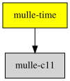

# mulle-time

#### 🕕 Simple time types with arithmetic on timespec and timeval

Defines `timespec_add`, `timespec_sub` and `timespec_compare` and their
timeval counterparts. `struct timespec` is more desirable, where available,
for improved precision in its representation.

This library defines `mulle_timeinterval_t` which will be used as 
`NSTimeInterval` in mulle-objc.


| Release Version                                       | Release Notes  | AI Documentation
|-------------------------------------------------------|----------------|---------------
|  [](//github.com/mulle-core/mulle-time/actions) | [RELEASENOTES](RELEASENOTES.md) | [DeepWiki for mulle-time](https://deepwiki.com/mulle-core/mulle-time)


## Documentation & Guides

* [API Summary](asset/dox/api/toc)


On Linux this library implicitly defines `_GNU_SOURCE` to get the 
`CLOCK_REALTIME` and `CLOCK_MONOTONIC` constants.

This library also defines these types based on `mulle_timeinterval_t`.

`mulle_calendartime_t` is to be used for keeping calendar related timestamps.
`mulle_absolutetime_t` is to be used for animation timestamps
`mulle_relativetime_t` is to be used for keeping delays and other relative quantities

These added types are mostly there to make code more readable, so that you
immediately know if a `mulle_timeinterval_t` contains, say a delay of 0.1s
or the date of "now + 0.1s".

Caution: do not mix `mulle_calendartime_t` and `mulle_absolutetime_t`


| Datatype                          | Description                                          |
|-----------------------------------|------------------------------------------------------|
| `mulle_timeinterval_t`            | absolute or relative time stored as a `double`       |
| `mulle_absolutetime_t`            | a timestamp                                          |
| `struct mulle_absolutetimerange`  | an absolute time range                               |
| `mulle_calendartime_t`            | a date value like today                              |
| `struct mulle_calendartimerange`  | an absolute date range, like today until tomorrow    |
| `mulle_relativetime_t`            | a quantity of time like 10s                          |
| `struct mulle_relativetimerange`  | a time range of relative times, like delay, duration |


### You are here




## Add

mulle-time is a component of the [mulle-core](//github.com/mulle-core/mulle-core) library. So in your code include the mulle-core umbrella header:

``` c
#include <mulle-core/mulle-core.h>
```

### Add mulle-core to a cmake and git project

``` bash
git submodule add https://github.com/mulle-core/mulle-core.git mulle-core
```

Add this to your `CMakeLists.txt`:

``` cmake
add_subdirectory( mulle-core)
target_link_libraries( ${PROJECT_NAME} PRIVATE mulle-core)
```


### Add mulle-core to a mulle-sde project

``` sh
mulle-sde add github:mulle-core/mulle-core
```

### Embed mulle-time with clib

``` sh
clib install --out src mulle-core/mulle-time
```

Append `src` to your include path (e.g. add `-isystem src`  to your `CFLAGS`)
and compile all the sources that were downloaded.

## Install

Use [mulle-sde](//github.com/mulle-sde) to build and install mulle-time and all dependencies:

``` sh
mulle-sde install --prefix /usr/local \
   https://github.com/mulle-core/mulle-time/archive/latest.tar.gz
```

### Legacy Installation

Install the requirements:

| Requirements                                 | Description
|----------------------------------------------|-----------------------
| [mulle-c11](https://github.com/mulle-c/mulle-c11)             | 🔀 Cross-platform C compiler glue (and some cpp conveniences)

Download the latest [tar](https://github.com/mulle-core/mulle-time/archive/refs/tags/latest.tar.gz) or [zip](https://github.com/mulle-core/mulle-time/archive/refs/tags/latest.zip) archive and unpack it.

Install **mulle-time** into `/usr/local` with [cmake](https://cmake.org):

``` sh
PREFIX_DIR="/usr/local"
cmake -B build                               \
      -DMULLE_SDK_PATH="${PREFIX_DIR}"       \
      -DCMAKE_INSTALL_PREFIX="${PREFIX_DIR}" \
      -DCMAKE_PREFIX_PATH="${PREFIX_DIR}"    \
      -DCMAKE_BUILD_TYPE=Release &&
cmake --build build --config Release &&
cmake --install build --config Release
```


## Author

[Nat!](https://mulle-kybernetik.com/weblog) for Mulle kybernetiK  


